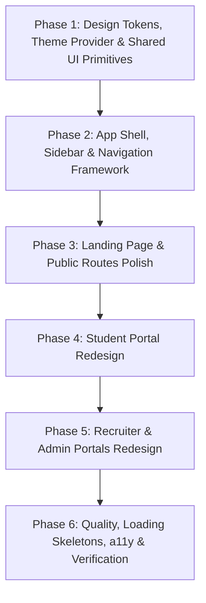

# AI Placement Copilot — UI/UX Redesign Master Plan

> **Document Version:** 2.0 (Finalized Specification)  
> **Status:** Plan finalized — awaiting explicit user approval before code modification.  
> **Aesthetic Benchmark:** Calm, Modern SaaS (Linear, Vercel, Raycast) — strong visual hierarchy, generous whitespace, restrained color accents, subtle borders/shadows, polished cards, consistent typography, purposeful micro-interactions. Zero excessive gradients, neon glows, or gimmicky animations.  
> **Scope Guarantee:** UI/UX layer only. Preserves 100% of Prisma schema, database models, Server Actions, API routes, authentication/Clerk flow, RBAC permissions, and Phase 1–8 functionality.

---

## 1. Key Design & Architectural Decisions

| Decision Area | Final Architecture & Rule |
|---|---|
| **Design Language** | Clean, minimalist, modern SaaS inspired by Linear, Vercel, and Raycast. Restrained palette: neutral canvas, subtle borders (`border-border`), quiet elevation (`shadow-xs` / `shadow-sm`), clear typographic contrast, and purposeful primary indigo/violet accents. |
| **Chart Strategy** | **Keep existing custom SVG solutions** (e.g. `SkillGapChart` SVG radar/spider matrix, SVG score dials, animated progress bars) where possible. Only introduce `recharts` if a dashboard trend/funnel visualization genuinely requires it. Do not add multiple charting libraries. |
| **Animation Strategy** | Pure CSS transitions (`transition-all duration-150 ease-out`), Tailwind keyframes (`tw-animate-css`), and subtle micro-interactions (button press scale `active:scale-[0.98]`, card hover border tint, smooth tab sliding). **No `framer-motion`** unless an animation strictly cannot be implemented cleanly with CSS. |
| **Libraries.dev Integration** | Will incorporate **ONLY** the specific Libraries.dev component prompts provided by the user. Components will be integrated selectively and purposefully into their intended places without random extra effects. |
| **Landing Page** | Fully polish the existing landing page (`/`) into a premium SaaS product page while **strictly preserving** its existing purpose, copy, data, and functionality. No fake testimonials, fabricated metrics, artificial pricing, or phantom features. Supports both light and dark themes. |
| **Navigation Architecture** | Unified **modern SaaS collapsible sidebar** on desktop (240px expanded / 64px icon-only rail) + responsive top header with breadcrumbs, theme switch, and user profile + **bottom tab navigation and slide-over sheet** on mobile devices. Preserves all existing routes and authentication flows. |
| **Dark / Light Mode** | Native, full-fidelity support across **every single page, layout, and component**. Zero leftover hardcoded light pastels (`bg-indigo-50` with no dark counterpart) and zero unreadable text in dark mode. Powered by `next-themes` with semantic CSS variables (`--color-background`, `--color-card`, `--color-border`, etc.). |
| **Responsive Design** | Dedicated layouts designed intentionally for Desktop (≥1024px), Tablet (768px–1023px), and Mobile (<768px) — touch-friendly 44px+ targets, collapsible panels, and responsive data displays. |
| **Functionality Preservation** | **Zero business logic drift.** All Server Actions (`src/actions/*`), API routes (`src/app/api/*`), schemas (`src/schemas/*`), database queries (`src/lib/db.ts`), rate limits, CSRF protection, CSP headers, and RBAC matrix remain intact. |

---

## 2. Dependencies & Package Strategy

To keep the application lean, performant, and reliable, dependencies are strictly minimized:

### New Dependencies Required
1. **`next-themes`** (~2 KB)
   - *Rationale:* Zero-overhead, standard theme provider for Next.js App Router to manage `.dark` class switching on `<html>` without hydration mismatch.
2. **`@radix-ui/react-tooltip`**, **`@radix-ui/react-progress`**, **`@radix-ui/react-tabs`** (~5 KB each)
   - *Rationale:* Accessible primitives for tooltips (sidebar collapsed icons), linear score progress meters, and status filter tabs. (Already using `@radix-ui/react-dialog`, `avatar`, `dropdown-menu`, `select`, `separator`, `slot`).
3. **`recharts`** *(Conditional)*
   - *Rationale:* Only installed if a specific dashboard requirement cannot be cleanly rendered with SVG/CSS.

### Dependencies Explicitly Avoided
- ❌ No `framer-motion` (pure CSS/Tailwind fulfills all motion requirements).
- ❌ No secondary charting libraries (no Chart.js, Tremor, ApexCharts).
- ❌ No secondary CSS frameworks or UI component packs (no Chakra, Mantine, AntD).

---

## 3. Global Design System Specification

### 3.1 Color Palette & Theme Tokens (OKLCH in `globals.css`)

```css
/* Light Mode */
--color-background: oklch(100% 0 0);           /* Pure white canvas */
--color-surface-subtle: oklch(98.5% 0.002 260);/* Very light neutral background */
--color-card: oklch(100% 0 0);                 /* Crisp card surface */
--color-card-foreground: oklch(14% 0.02 260);  /* Deep charcoal text */
--color-border: oklch(92% 0.005 260);          /* 1px subtle divider */
--color-muted: oklch(96% 0.005 260);           /* Light gray container */
--color-muted-foreground: oklch(48% 0.01 260); /* High-contrast secondary text */

/* Dark Mode */
--color-background: oklch(12% 0.015 260);      /* Deep charcoal canvas */
--color-surface-subtle: oklch(14% 0.015 260);  /* Subtle background panel */
--color-card: oklch(16% 0.015 260);            /* Card surface */
--color-card-foreground: oklch(96% 0.005 260); /* Crisp off-white text */
--color-border: oklch(22% 0.015 260);          /* Subtle dark border */
--color-muted: oklch(20% 0.015 260);           /* Subtle secondary surface */
--color-muted-foreground: oklch(65% 0.01 260); /* Readable muted text */

/* Brand & Semantic Accents */
--color-primary: oklch(58% 0.19 270);          /* Modern Indigo */
--color-primary-foreground: oklch(98% 0 0);
--color-success: oklch(65% 0.18 155);          /* Emerald */
--color-warning: oklch(75% 0.15 85);           /* Amber */
--color-destructive: oklch(60% 0.22 27);       /* Rose */
```

### 3.2 Typography Scale

- **Page Title:** `text-2xl font-bold tracking-tight text-foreground` (28px)
- **Section Heading:** `text-lg font-semibold tracking-tight text-foreground` (18px)
- **Card Title:** `text-sm font-semibold text-foreground` (14px)
- **Body Text:** `text-sm text-foreground/90 leading-relaxed` (14px)
- **Muted / Subtext:** `text-xs text-muted-foreground` (12px)
- **Eyebrow / Category:** `text-[11px] font-semibold uppercase tracking-wider text-muted-foreground`
- **Stat Values:** `text-2xl sm:text-3xl font-bold tabular-nums text-foreground`

### 3.3 Surface & Card Rhythm
- Cards have standard `rounded-xl border border-border bg-card p-5 sm:p-6 shadow-xs`.
- Hover cards feature a refined 150ms transition: `hover:border-primary/30 hover:shadow-sm`.
- Form inputs standardize on `h-9 rounded-lg border border-border bg-background px-3 text-sm focus-visible:ring-1 focus-visible:ring-primary`.
- Buttons use standard heights: `h-9 px-4 text-xs font-semibold` (standard), `h-8 px-3 text-xs` (compact), `h-10 px-5 text-sm` (prominent).

---

## 4. Navigation Architecture & App Shell

### 4.1 Shell Layout Structure (`src/components/layout/`)

```
┌────────────────────────────────────────────────────────────────────────┐
│ App Shell Container                                                    │
├──────────────┬─────────────────────────────────────────────────────────┤
│ Sidebar      │ Main Content Wrapper                                    │
│ (Desktop     ├─────────────────────────────────────────────────────────┤
│  240px /     │ Header Bar (h-14, sticky top-0, z-30, backdrop-blur-md) │
│  Collapsed   │ ├─ Breadcrumbs / Title        ├─ Search / Theme / User ─┤
│  64px)       ├─────────────────────────────────────────────────────────┤
│ ├─ Brand     │ Page Canvas (scrollable container, max-w-7xl, p-6)      │
│ ├─ Nav Items │                                                         │
│ ├─ Separator │                                                         │
│ ├─ Secondary │                                                         │
│ ├─ Collapse  │                                                         │
│ └─ User      ├─────────────────────────────────────────────────────────┤
│              │ Mobile Bottom Bar (h-16, fixed bottom-0, md:hidden)     │
└──────────────┴─────────────────────────────────────────────────────────┘
```

### 4.2 Portal Navigation Map

1. **Student Portal (`(student)`):**
   - Primary: Dashboard (`/dashboard`), Jobs (`/jobs`), Applications (`/applications`), Interviews (`/interviews`), Resume (`/resume`).
   - Intelligence: Skill Gap (`/skill-gap`), Career Roadmap (`/career`), Experiences (`/experiences`).
   - Account: Profile (`/profile`).

2. **Recruiter Portal (`(recruiter)`):**
   - Operations: Dashboard (`/recruiter/dashboard`), Job Listings (`/recruiter/jobs`), Applicants (`/recruiter/applicants`), Experiences (`/recruiter/experiences`).
   - Organization: Company Settings (`/recruiter/company`), Team Management (`/recruiter/team`).

3. **Admin Portal (`(admin)`):**
   - Governance: Overview (`/admin/dashboard`), Audit Trail (`/admin/audit-log`).

4. **Mobile Navigation Solution:**
   - 5 primary destinations on bottom tab bar with clean Lucide icons and active indicator dot.
   - "More" trigger opens a smooth bottom sheet for secondary navigation links and portal options.

---

## 5. Phased Implementation Plan



### Phase 1: Design Tokens, Theme Provider & Shared UI Primitives
*Target: Establish the rock-solid design system foundation before touching page layouts.*
- **Step 1.1:** Update `src/app/globals.css` with clean, modern OKLCH tokens for both light and dark modes, shadow variables, and removal of old garish gradient utilities.
- **Step 1.2:** Install `next-themes` and create `src/components/theme/theme-provider.tsx` and `src/components/theme/theme-toggle.tsx`. Wrap root layout safely.
- **Step 1.3:** Build/standardize core UI primitives in `src/components/ui/`:
  - `button.tsx` (Variants: default, secondary, outline, ghost, destructive; with loading spinner state)
  - `card.tsx` (Card, CardHeader, CardTitle, CardDescription, CardContent, CardFooter)
  - `input.tsx` & `label.tsx` (Consistent form controls)
  - `tabs.tsx` (Clean animated/sliding indicator tabs)
  - `skeleton.tsx` (Modern pulse/shimmer placeholders)
  - `progress.tsx` (Accessible progress meters)
  - `tooltip.tsx` (For collapsed sidebar item hints)
- **Step 1.4:** Build shared business components in `src/components/shared/`:
  - `page-header.tsx` (Breadcrumb + title + description + action slot)
  - `stat-card.tsx` (Unified metric card supporting trend indicator, icon, value, caption)
  - `empty-state.tsx` (Standardized empty state with icon, title, description, optional action)
  - `status-badge.tsx` (Unified status badges for applications, jobs, interviews, and audit logs)
  - `search-input.tsx` (Debounced text search with clear icon)
  - `confirm-dialog.tsx` (Reusable modal confirmation replacing per-feature duplicates)
- **Verification:** Run `npm run build` and `npx tsc --noEmit` to verify zero regression.

---

### Phase 2: App Shell, Sidebar & Navigation Framework
*Target: Replace inconsistent headers with a unified, responsive sidebar and mobile shell.*
- **Step 2.1:** Build `src/components/layout/sidebar.tsx` with collapsible desktop rail (240px ↔ 64px), persistent local storage state, active route detection, and tooltip support.
- **Step 2.2:** Build `src/components/layout/top-header.tsx` with breadcrumbs, page header action slots, theme toggle, and Clerk `<UserButton />`.
- **Step 2.3:** Build `src/components/layout/mobile-nav.tsx` (bottom tab bar + slide-over drawer).
- **Step 2.4:** Build `src/components/layout/app-shell.tsx` combining sidebar, top header, mobile nav, and scrollable container.
- **Step 2.5:** Update portal layouts:
  - `src/app/(student)/layout.tsx` → Mount student navigation shell.
  - `src/app/(recruiter)/layout.tsx` → Mount recruiter navigation shell.
  - `src/app/(admin)/layout.tsx` → Mount admin navigation shell.
- **Step 2.6:** Move `src/app/dashboard/page.tsx` to `src/app/(student)/dashboard/page.tsx` so student dashboard correctly inherits the student shell while retaining its `/dashboard` route.
- **Verification:** Run `npm run build` to confirm all 35+ routes build and navigate cleanly.

---

### Phase 3: Landing Page & Public Routes Polish
*Target: Elevate the public-facing touchpoints to premium SaaS standards without altering copy or functionality.*
- **Step 3.1:** Redesign `src/app/page.tsx` (Landing Page):
  - Retain existing headline: *"Your Intelligent Career Copilot"*, subtext, and Clerk auth actions.
  - Replace raw emojis with refined Lucide iconography inside subtle badge tiles.
  - Apply clean card borders, elevated typography, and light/dark theme compatibility.
  - Integrate footer with the existing email subscription widget (`EmailSubscriptionCard`).
- **Step 3.2:** Polish auth wrapper layouts (`src/app/(auth)/layout.tsx` and sign-in/up pages) with consistent background, brand mark, and theme-neutral containers.
- **Step 3.3:** Polish onboarding flow (`src/app/onboarding/page.tsx`, `student/page.tsx`, `recruiter/page.tsx`) with cleaner step-indicator cards and improved field spacing.
- **Verification:** Test `/`, `/sign-in`, `/sign-up`, and `/onboarding` in both light and dark modes.

---

### Phase 4: Student Portal Redesign
*Target: Transform all student-facing workflows into a cohesive, Linear-grade workspace.*
- **Step 4.1: Dashboard (`/dashboard`):**
  - Implement top greeting bar, 4 unified `StatCard` metrics, active career roadmap progress card, semantic recommended jobs row, recent applications list, and mock interview summaries.
- **Step 4.2: Jobs Discovery (`/jobs` & `/jobs/[id]`):**
  - Redesign `job-card.tsx` with refined match-score pill, company logo avatar, and subtle border hover.
  - Redesign `job-filters.tsx` using styled `Input` and `Select` components.
  - Polish `/jobs/[id]` with 2-column overview, company sidebar card, and prominent application CTA.
- **Step 4.3: Applications Hub (`/applications` & `/applications/[id]`):**
  - Redesign `applications-list-client.tsx` with clean filter tabs, counter badges, and responsive card grid.
  - Polish `/applications/[id]` timeline view (`application-timeline.tsx`) with clean step markers.
- **Step 4.4: AI Mock Interviews (`/interviews`, `/interviews/new`, `/interviews/[id]`, `/feedback`):**
  - Polish interviews list and `interview-card.tsx`.
  - Redesign `create-interview-form.tsx` with structured multi-step cards and clear tech-stack tag chips.
  - Refine `interview-agent.tsx` real-time audio room (clean audio visualizer, live status badge, transcript stream).
  - Polish `feedback-view.tsx` with score dials, strength/improvement lists, and per-question cards.
- **Step 4.5: Resume Intelligence (`/resume`):**
  - Redesign `resume-uploader.tsx` with refined drag-and-drop zone and progress feedback.
  - Polish `resume-analysis-view.tsx` with clean category score cards, ATS pill indicators, and keyword tag clouds.
- **Step 4.6: Career & Skill Gap (`/career`, `/skill-gap`, `/career/insights`):**
  - Refine `skill-gap-view.tsx` and preserve existing vector SVG `SkillGapChart` with high-contrast theme strokes.
  - Polish `career-roadmap-view.tsx` milestone cards and actionable resource links.
- **Step 4.7: Experiences & Profile (`/experiences`, `/profile`):**
  - Polish interview experience cards and student profile form.
- **Verification:** Run `npm run build` and local route checks.

---

### Phase 5: Recruiter & Admin Portals Redesign
*Target: Deliver professional, clean operational dashboards for recruiters and administrators.*
- **Step 5.1: Recruiter Dashboard (`/recruiter/dashboard`):**
  - 4 unified `StatCard` metrics, candidate pipeline overview, team cards, and quick operation buttons.
- **Step 5.2: Recruiter Candidate Management (`/recruiter/applicants`, `jobs/[id]/applicants`):**
  - Polish `recruiter-applicants-client.tsx` desktop table view and mobile card view.
  - Polish candidate detail page (`/recruiter/applicants/[id]`) with resume data, skills, and status transition selector.
- **Step 5.3: Recruiter Jobs & Company (`/recruiter/jobs`, `/recruiter/company`, `/recruiter/team`):**
  - Refine job listing table with toggle switches and modal deletion confirmation.
  - Polish company profile view and team member management modal (`invite-member-modal.tsx`).
- **Step 5.4: Admin Overview & Moderation (`/admin/dashboard`):**
  - 6 platform metric cards, job moderation listing with instant visibility toggles, and recent user signups.
- **Step 5.5: Admin Audit Trail (`/admin/audit-log`):**
  - High-density, readable tabular audit log with action filter pills, timestamp formatting, and payload inspector.
- **Verification:** Run `npm run build` and verify recruiter/admin authorization boundaries.

---

### Phase 6: Quality, Loading Skeletons, a11y & Verification
*Target: Complete polish, loading state parity, accessibility standards, and end-to-end verification.*
- **Step 6.1: Full Loading Skeletons Parity:**
  - Create/standardize missing `loading.tsx` files across all routes with page-matching `Skeleton` layouts.
- **Step 6.2: Accessibility (a11y) & Contrast Review:**
  - Add skip-to-content links, ensure all icon buttons have `aria-label`, verify WCAG AA contrast for text, and check focus-visible rings.
- **Step 6.3: Theme Contrast Verification:**
  - Audit every page in both light and dark modes to guarantee zero low-contrast text or un-themed light pastel cards.
- **Step 6.4: Full Test Suite & Build Verification:**
  - `npm run build` (Turbopack compile across all routes)
  - `npx tsc --noEmit` (strict TypeScript validation)
  - `npx tsx scripts/test-phase8-hardening.ts` (Phase 8 hardening verification)
  - `npx tsx scripts/test-rate-limit.ts` (Rate limit suite verification)

---

## 6. Detailed File Change Manifest

### New Files to Create (~16 files)
```
src/components/theme/
├── theme-provider.tsx               # Next-themes client wrapper
└── theme-toggle.tsx                 # Sun/Moon/System theme switcher button

src/components/ui/
├── button.tsx                       # Unified button primitive (cva variants)
├── card.tsx                         # Unified card container primitives
├── input.tsx                        # Unified text input primitive
├── label.tsx                        # Accessible label primitive
├── tabs.tsx                         # Sliding pill tabs primitive
├── skeleton.tsx                     # Shimmer/pulse loading primitive
├── progress.tsx                     # Accessible progress bar primitive
└── tooltip.tsx                      # Icon hint tooltip primitive

src/components/shared/
├── page-header.tsx                  # Standard page header with breadcrumbs and actions
├── stat-card.tsx                    # Reusable SaaS metric/stat card with trend support
├── empty-state.tsx                  # Reusable empty state view
├── status-badge.tsx                 # Centralized status pill component
├── search-input.tsx                 # Debounced search box
└── confirm-dialog.tsx               # Standard modal confirmation dialog

src/components/layout/
├── sidebar.tsx                      # Collapsible desktop SaaS sidebar
├── top-header.tsx                   # Sticky top header with breadcrumbs & user profile
├── mobile-nav.tsx                   # Mobile bottom tab bar & drawer
└── app-shell.tsx                    # Unified responsive shell wrapper
```

### Files to Relocate (1 file)
```
src/app/dashboard/page.tsx → src/app/(student)/dashboard/page.tsx
# Reason: Allows student dashboard to inherit the student shell and Clerk context while keeping the exact /dashboard URL.
```

### Layouts to Update (4 files)
```
src/app/layout.tsx                   # Add ThemeProvider and Toaster theme alignment
src/app/(student)/layout.tsx         # Replace top-only nav with AppShell
src/app/(recruiter)/layout.tsx       # Replace top-only nav with AppShell
src/app/(admin)/layout.tsx           # Replace top-only nav with AppShell
```

### Pages to Update (~16 files)
```
src/app/page.tsx                     # Premium SaaS landing page polish
src/app/(auth)/layout.tsx            # Clean auth container styling
src/app/(student)/jobs/page.tsx      # Standardized cards, filters, and header
src/app/(student)/jobs/[id]/page.tsx # Polished 2-column detail view
src/app/(student)/applications/page.tsx
src/app/(student)/applications/[id]/page.tsx
src/app/(student)/interviews/page.tsx
src/app/(student)/interviews/new/page.tsx
src/app/(student)/interviews/[id]/page.tsx
src/app/(student)/resume/page.tsx
src/app/(student)/career/page.tsx
src/app/(student)/skill-gap/page.tsx
src/app/(recruiter)/recruiter/dashboard/page.tsx
src/app/(recruiter)/recruiter/applicants/page.tsx
src/app/(admin)/admin/dashboard/page.tsx
src/app/(admin)/admin/audit-log/page.tsx
```

### Feature Components to Refactor (~12 files)
```
src/components/jobs/job-card.tsx
src/components/jobs/job-filters.tsx
src/components/applications/application-card.tsx
src/components/applications/applications-list-client.tsx
src/components/applications/recruiter-applicants-client.tsx
src/components/interviews/interview-card.tsx
src/components/interviews/feedback-view.tsx
src/components/resume/resume-analysis-view.tsx
src/components/resume/resume-uploader.tsx
src/components/career/skill-gap-view.tsx
src/components/career/career-roadmap-view.tsx
src/components/subscription/email-subscription-card.tsx
```

---

## 7. Execution Rules & Safety Safeguards

1. **Sequential Execution:** Never execute multiple phases simultaneously. Complete Phase 1 fully, test and verify, then proceed to Phase 2.
2. **Typecheck Guarantee:** `npx tsc --noEmit` must return 0 errors after every phase.
3. **Build Guarantee:** `npm run build` must succeed after every phase with all routes compiling.
4. **Logic Immutability:** Never modify action files (`src/actions/*`), API handlers (`src/app/api/*`), database queries (`src/lib/db.ts`), or Prisma schema.
5. **No Phantom Content:** Never introduce mock data or placeholders that misrepresent the real state of the user's database.

---
*End of Master Plan. Implementation will strictly follow this document upon receiving user approval.*
