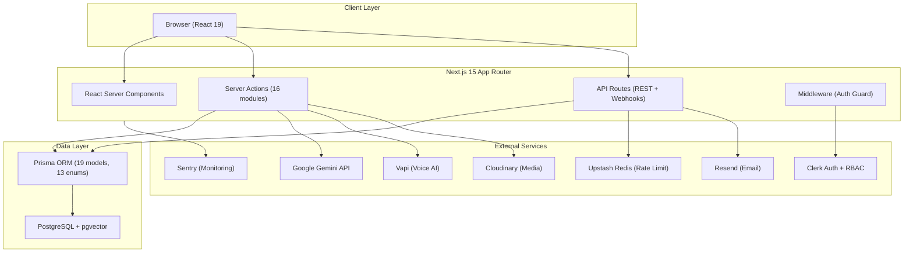

<div align="center">

# AI Placement Copilot

**An AI-powered career intelligence platform for placement preparation, semantic job matching, and end-to-end recruitment management.**

[](https://nextjs.org/)
[](https://react.dev/)
[](https://www.typescriptlang.org/)
[](https://www.postgresql.org/)
[](https://www.prisma.io/)
[](https://ai.google.dev/)
[](https://clerk.com/)
[](https://tailwindcss.com/)

</div>

---

## Overview

Campus placements demand that students simultaneously optimize resumes for ATS systems, practice for technical interviews, track dozens of applications, and identify skill gaps — using disconnected tools with no shared intelligence layer.

**AI Placement Copilot** is a multi-role SaaS platform that unifies these concerns into a single AI-driven workflow. Students get ATS resume analysis, vector-based job recommendations, AI voice mock interviews, skill-gap detection, and personalized career roadmaps. Recruiters manage job postings, pipeline applicants, and publish interview experiences. Administrators govern users, companies, and audit trails.

The platform uses **Google Gemini** for structured AI generation, **pgvector** for high-dimensional semantic search, **Clerk** for authentication and RBAC, and **Next.js 15 App Router** with React Server Components for a modern full-stack architecture.

---

## Key Features

### Student Portal

- **AI Resume/ATS Analysis** — Upload a PDF resume, extract text via `pdf-parse`, and receive structured Gemini-generated scores (overall, format, content, ATS), keyword analysis, section-level breakdowns, and actionable improvement suggestions.
- **Semantic Job Matching** — 768-dimensional Gemini embeddings stored in PostgreSQL via `pgvector`, with raw SQL cosine-distance queries (`<=>`) ranking jobs by competency fit rather than keyword overlap.
- **AI Voice Mock Interviews** — Real-time conversational interview simulation powered by Vapi Web SDK, with AI-generated questions tailored to role, tech stack, and difficulty level, followed by structured Gemini feedback scoring.
- **Skill-Gap Analysis** — AI-driven gap detection cross-referencing a student's profile, resume, and interview history against target role requirements to identify missing and improving skills.
- **Career Roadmaps** — Personalized milestone-based learning paths generated by Gemini, factoring in current skills, latest skill-gap results, and placement timelines.
- **AI Career Recommendations** — Context-aware suggestions for jobs, skills, courses, and interview practice based on the student's profile and activity.
- **Job Discovery & Filtering** — Paginated job feed with multi-field filtering (category, location, level, type), keyword search, and one-click application.
- **Application Tracking** — Full lifecycle visibility across Pending → Reviewed → Shortlisted → Interview Scheduled → Accepted/Rejected/Withdrawn.
- **Interview Experience Sharing** — Students submit detailed interview round breakdowns, questions, preparation strategies, and outcomes for peer benefit.
- **Profile Management** — Skills, education, preferred locations/categories, portfolio links, and salary expectations.

### Recruiter Portal

- **Job Management** — Create, edit, toggle visibility, and delete job postings with rich descriptions, salary ranges, tech stacks, and deadline management.
- **Applicant Pipeline** — Review incoming applications, update statuses, and manage candidate progression.
- **Interview Experiences** — Publish verified company interview processes with category, level, and compensation details.
- **Team & Company Management** — Multi-member companies with role-based access (Owner, Admin, Recruiter, HR, Interviewer).
- **Company Profiles** — Logo, industry, size, website, and verification status.

### Admin Portal

- **Platform Dashboard** — Aggregated user, company, job, and application metrics.
- **Audit Log Viewer** — Searchable, paginated audit trail of all platform mutations with IP address, user agent, and metadata capture.
- **User & Company Governance** — Role management and platform-level oversight.

### AI & Career Intelligence

| Capability | AI Model | Output |
|---|---|---|
| Resume ATS Scoring | Gemini (structured generation) | Scores, keywords, section analysis, suggestions |
| Interview Question Generation | Gemini (structured generation) | Role-specific technical & behavioral questions |
| Interview Feedback | Gemini (structured generation) | Category scores, strengths, areas for improvement |
| Skill-Gap Analysis | Gemini (structured generation) | Missing skills, match %, prioritized recommendations |
| Career Roadmap | Gemini (structured generation) | Weekly milestones, resources, timeline |
| Career Recommendations | Gemini (structured generation) | Job, skill, course, interview recommendations |
| Job Embeddings | Gemini `gemini-embedding-001` | 768-dim vectors stored in pgvector |
| Resume Embeddings | Gemini `gemini-embedding-001` | 768-dim vectors for cosine similarity |

---

## AI Architecture

```
┌─────────────────────────────────────────────────────────────────┐
│                    AI Intelligence Layer                        │
├─────────────────────────────────────────────────────────────────┤
│                                                                 │
│  ┌──────────────┐   ┌──────────────┐   ┌───────────────────┐   │
│  │ Gemini Flash  │   │ Gemini       │   │ Vercel AI SDK     │   │
│  │ (Text Gen)    │   │ Embeddings   │   │ (generateObject)  │   │
│  │ 3.7 → 3.6    │   │ 768-dim      │   │ + Zod Schemas     │   │
│  │ → 3.8        │   │              │   │                   │   │
│  └──────┬───────┘   └──────┬───────┘   └───────┬───────────┘   │
│         │                  │                    │               │
│  ┌──────┴──────────────────┴────────────────────┴───────────┐   │
│  │            executeWithRetryAndFallback()                  │   │
│  │    Multi-model cascade · Exponential backoff              │   │
│  │    Transient error detection (429, 503, rate limits)      │   │
│  └──────────────────────────┬────────────────────────────────┘   │
│                             │                                   │
├─────────────────────────────┼───────────────────────────────────┤
│                             ▼                                   │
│  ┌──────────────────────────────────────────────────────────┐   │
│  │              PostgreSQL + pgvector                        │   │
│  │  Resume vectors ←──── cosine distance (<=>) ────→ Job    │   │
│  │                    vectors                                │   │
│  └──────────────────────────────────────────────────────────┘   │
└─────────────────────────────────────────────────────────────────┘
```

- **Structured AI Output** — All Gemini calls use `generateObject()` from the Vercel AI SDK with Zod schemas, ensuring type-safe, validated AI responses with no free-text parsing.
- **Multi-Model Fallback** — A centralized `executeWithRetryAndFallback()` function cascades through Gemini model variants (`gemini-3.7-flash` → `gemini-3.6-flash` → `gemini-3.8-flash`) with per-model retries and transient error detection for 429, 503, rate limit, and timeout conditions.
- **Vector Embeddings** — Gemini `gemini-embedding-001` generates 768-dimensional embeddings for both job descriptions and resume text, stored natively in PostgreSQL via the `pgvector` extension and queried using the cosine distance operator (`<=>`).

---

## Semantic Job Matching

The platform implements a full vector-based job recommendation pipeline:

1. **Resume Upload** — The student uploads a PDF; text is extracted via `pdf-parse` and stored in the `Resume` table.
2. **Embedding Generation** — The extracted text is sent to `gemini-embedding-001`, which returns a 768-dimensional float vector. The vector is stored in a `vector(768)` column using PostgreSQL's `pgvector` extension.
3. **Job Embeddings** — Each job posting generates an embedding from its title, description, category, level, location, and type, also stored as `vector(768)`.
4. **Cosine Similarity Ranking** — When a student requests recommendations, a raw SQL query computes `1 - (job.embedding <=> resume.embedding)` to rank all visible jobs by semantic similarity.
5. **Enriched Results** — The top-ranked job IDs are hydrated with full job details, company information, and the student's existing application status.

This approach surfaces jobs that match the student's actual competency profile, not just shared keywords.

---

## Technical Architecture



### Tech Stack

| Layer | Technology |
|---|---|
| Framework | Next.js 16, React 19, TypeScript 5 |
| Styling | Tailwind CSS v4, Radix UI, `class-variance-authority` |
| Database | PostgreSQL, pgvector extension |
| ORM | Prisma 6 (19 models, 13 enums, GIN indexes) |
| Authentication | Clerk (SSO, webhooks, session management) |
| AI / LLM | Google Gemini (Flash + Embeddings), Vercel AI SDK |
| Voice AI | Vapi Web SDK |
| Validation | Zod (16 schema modules) |
| Rate Limiting | Upstash Redis (sliding window) |
| Media Storage | Cloudinary |
| PDF Processing | `pdf-parse`, `unpdf` |
| Email | Resend |
| Monitoring | Sentry |
| Forms | React Hook Form + Zod resolver |
| State | TanStack React Query |
| Theme | `next-themes` (light/dark/system) |

---

## Security & Reliability

| Practice | Implementation |
|---|---|
| **Authentication** | Clerk with webhook-based user sync, session tokens, and middleware route guards |
| **Role-Based Access Control** | Three-tier platform RBAC (`STUDENT`, `RECRUITER`, `ADMIN`) + five-tier company RBAC (`OWNER` > `ADMIN` > `RECRUITER` > `HR` > `INTERVIEWER`) with `requireCompanyPermission()` enforcement on every mutation |
| **Input Validation** | Zod schemas on all Server Actions and API routes; 16 dedicated schema modules covering every domain entity |
| **Rate Limiting** | Upstash Redis sliding-window rate limiting with preset tiers (`SEARCH`: 20/min, `AI_GENERATE`: 10/min, `SUBSCRIBE`: 5/min, `PUBLIC_API`: 60/min) and graceful in-memory fallback |
| **Audit Logging** | Every state-changing operation records action, entity type, entity ID, user ID, IP address, user agent, and structured metadata via `createAuditLog()` — designed to never throw and never block the primary operation |
| **Monitoring** | Sentry integration for error tracking and performance monitoring |
| **Secure Media** | Cloudinary for file upload/storage with URL-based access |
| **Webhook Verification** | Clerk webhook signature verification via `svix` |
| **CSRF Protection** | Next.js Server Actions with built-in CSRF token validation |
| **Data Isolation** | Company-scoped data access; recruiter queries filter by `companyId` after permission checks |

---

## UI / UX

- **Role-Based AppShell** — Unified sidebar + top header layout with role-specific navigation for Student, Recruiter, and Admin portals, plus responsive mobile drawer navigation.
- **Design System** — Reusable UI primitives (`Button`, `Card`, `Input`, `Label`, `Tabs`, `Skeleton`, `Progress`, `Tooltip`, `Dialog`, `Select`, `Badge`, `Avatar`, `Separator`, `Dropdown Menu`) built on Radix UI with `class-variance-authority` variants.
- **Shared Components** — `PageHeader`, `StatCard`, `EmptyState`, `StatusBadge`, `SearchInput`, `ConfirmDialog` for consistent patterns across all portals.
- **Dark/Light Themes** — `next-themes` with system detection, deep dark mode tokens, and `shadow-inner-glow` specular highlights for dark surfaces.
- **Responsive Design** — Mobile-first Tailwind CSS layouts across all pages and components.
- **Accessible** — Radix UI primitives provide keyboard navigation, focus management, and ARIA attributes.

---

## Project Structure

```
ai-placement-copilot/
├── prisma/
│   ├── schema.prisma          # 19 models, 13 enums, pgvector
│   └── seed.ts                # Database seeding
├── src/
│   ├── actions/               # 16 Server Action modules
│   │   ├── student-jobs.ts    # Job feed, apply, recommendations (pgvector)
│   │   ├── resume.ts          # Upload, analyze, ATS scoring
│   │   ├── interviews.ts      # Schedule, manage, feedback
│   │   ├── career.ts          # Roadmaps, insights
│   │   ├── skill-gap.ts       # AI skill-gap analysis
│   │   ├── experiences.ts     # CRUD + student submission
│   │   ├── applications.ts    # Application lifecycle
│   │   ├── jobs.ts            # Recruiter job management
│   │   ├── company.ts         # Company & team management
│   │   ├── admin.ts           # Platform governance
│   │   └── ...
│   ├── app/
│   │   ├── (student)/         # Student routes (dashboard, jobs, resume, ...)
│   │   ├── (recruiter)/       # Recruiter routes (dashboard, jobs, team, ...)
│   │   ├── (admin)/           # Admin routes (dashboard, audit-log)
│   │   ├── (auth)/            # Sign-in, sign-up (Clerk)
│   │   ├── api/               # REST endpoints, webhooks, cron jobs
│   │   ├── onboarding/        # Student & recruiter onboarding
│   │   ├── page.tsx           # Landing page
│   │   ├── layout.tsx         # Root layout (ThemeProvider, Toaster)
│   │   └── globals.css        # Design tokens, dark mode, utilities
│   ├── components/
│   │   ├── ui/                # Radix UI primitives (17 components)
│   │   ├── shared/            # Cross-portal shared components
│   │   ├── layout/            # AppShell, Sidebar, TopHeader, MobileNav
│   │   ├── jobs/              # Job cards, filters, pagination, badges
│   │   ├── interviews/        # Interview cards, voice agent
│   │   ├── resume/            # Upload, analysis display
│   │   ├── experiences/       # Cards, filters, submission dialog
│   │   ├── applications/      # Cards, status badges
│   │   ├── career/            # Recommendations, roadmap display
│   │   └── theme/             # ThemeProvider, ThemeToggle
│   ├── lib/
│   │   ├── ai/                # Gemini client, embeddings, resume analyzer,
│   │   │                      #   skill-gap, roadmap, interview feedback,
│   │   │                      #   question gen, recommendation engine
│   │   ├── auth/              # RBAC (role hierarchy, permission checks)
│   │   ├── audit.ts           # Audit trail logger
│   │   ├── rate-limit.ts      # Upstash Redis rate limiter
│   │   ├── db.ts              # Prisma client singleton
│   │   ├── cloudinary.ts      # Media upload helpers
│   │   ├── email.ts           # Resend email integration
│   │   ├── vapi.ts            # Vapi Web SDK singleton
│   │   └── sentry.ts          # Sentry configuration
│   ├── schemas/               # 16 Zod validation schema modules
│   ├── hooks/                 # Custom React hooks
│   └── types/                 # TypeScript type definitions
├── package.json
├── tsconfig.json
└── next.config.ts
```

---

## Getting Started

### Prerequisites

- **Node.js** ≥ 18
- **PostgreSQL** with the `pgvector` extension enabled
- A **Clerk** account (for authentication)
- A **Google Gemini API** key

### Installation

```bash
# Clone the repository
git clone https://github.com/<your-username>/ai-placement-copilot.git
cd ai-placement-copilot/app

# Install dependencies
npm install

# Configure environment variables
cp .env.example .env.local
# Edit .env.local with your credentials (see Environment Variables below)

# Generate Prisma client
npx prisma generate

# Push schema to database (or run migrations)
npx prisma db push

# Seed the database (optional)
npm run db:seed

# Start the development server
npm run dev
```

The application will be available at `http://localhost:3000`.

---

## Environment Variables

Create a `.env.local` file with the following variables. **Never commit secret values.**

```env
# Database
DATABASE_URL=

# Clerk Authentication
NEXT_PUBLIC_CLERK_PUBLISHABLE_KEY=
CLERK_SECRET_KEY=
CLERK_WEBHOOK_SECRET=
NEXT_PUBLIC_CLERK_SIGN_IN_URL=/sign-in
NEXT_PUBLIC_CLERK_SIGN_UP_URL=/sign-up

# Google Gemini AI
GOOGLE_GENERATIVE_AI_API_KEY=
GEMINI_MODEL=gemini-3.7-flash
GEMINI_FALLBACK_MODEL=gemini-3.6-flash

# Vapi (Voice AI Interviews)
NEXT_PUBLIC_VAPI_WEB_TOKEN=
NEXT_PUBLIC_VAPI_ASSISTANT_ID=

# Upstash Redis (Rate Limiting)
UPSTASH_REDIS_REST_URL=
UPSTASH_REDIS_REST_TOKEN=

# Cloudinary (Media Storage)
CLOUDINARY_CLOUD_NAME=
CLOUDINARY_API_KEY=
CLOUDINARY_API_SECRET=

# Resend (Email)
RESEND_API_KEY=

# Sentry (Monitoring)
SENTRY_DSN=
```

---

## Scripts

| Command | Description |
|---|---|
| `npm run dev` | Start development server (Turbopack) |
| `npm run build` | Production build |
| `npm run start` | Start production server |
| `npm run lint` | Run ESLint |
| `npm run db:generate` | Regenerate Prisma client |
| `npm run db:push` | Push schema to database |
| `npm run db:migrate` | Run Prisma migrations |
| `npm run db:studio` | Open Prisma Studio |
| `npm run db:seed` | Seed database |

---

## Engineering Highlights

- **Semantic Search Infrastructure** — End-to-end vector pipeline from text extraction through Gemini embedding generation to pgvector cosine-distance ranking, all within PostgreSQL.
- **Resilient AI Layer** — Centralized retry/fallback orchestration across three Gemini model variants with transient error detection, preventing single-model API outages from degrading the user experience.
- **Structured AI Outputs** — Every AI generation call returns Zod-validated typed objects via `generateObject()`, eliminating free-text parsing and ensuring schema-safe downstream consumption.
- **Multi-Tenant RBAC** — Two-layer access control: platform-level roles (`STUDENT` / `RECRUITER` / `ADMIN`) and company-level roles (`OWNER` > `ADMIN` > `RECRUITER` > `HR` > `INTERVIEWER`) with granular per-action permission enforcement.
- **Non-Blocking Audit Trail** — Fire-and-forget audit logging that captures IP, user agent, and structured metadata on every mutation without ever blocking or failing the primary operation.
- **Modular Server Actions** — 16 dedicated action modules with co-located Zod validation, RBAC checks, audit logging, and path revalidation — no monolithic API handlers.
- **Component Architecture** — 17 Radix UI primitives, role-aware layout system, and shared SaaS components (`StatCard`, `PageHeader`, `EmptyState`, `StatusBadge`) ensuring visual consistency across three portals.

---

## Future Improvements

- **Interview Recording & Playback** — Store voice interview audio for student self-review and historical performance comparison.
- **Company Analytics Dashboard** — Deeper hiring funnel metrics, time-to-fill tracking, and candidate quality scoring for recruiters.
- **Batch Embedding Updates** — Background job queue for re-embedding jobs/resumes when models are upgraded.
- **Real-Time Notifications** — WebSocket or SSE-based push notifications for application status changes and interview scheduling.
- **Deployment CI/CD** — Automated preview deployments and production pipelines.

---

## Screenshots

> **Note:** Replace the placeholder paths below with actual screenshots.

| View | Screenshot |
|---|---|
| Landing Page |  |
| Student Dashboard |  |
| AI Resume Analysis |  |
| Job Recommendations |  |
| Mock Interview |  |
| Recruiter Dashboard |  |
| Admin Audit Log |  |

---

## License

This project is for educational and portfolio demonstration purposes.

---

<div align="center">

**Built with Next.js 16 · React 19 · TypeScript · PostgreSQL · pgvector · Google Gemini · Clerk · Prisma**

</div>
